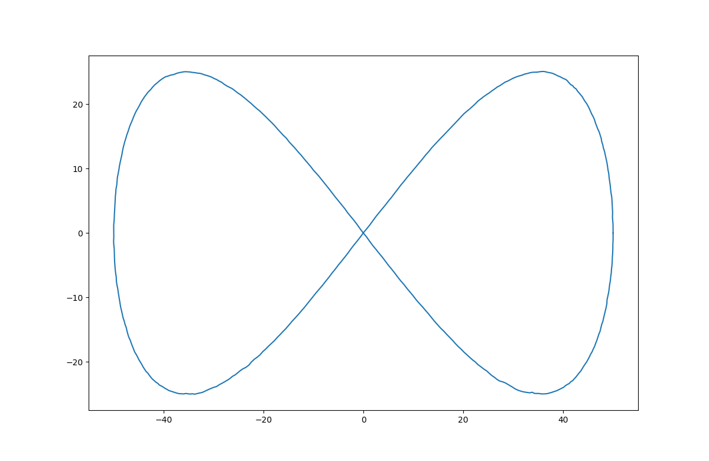
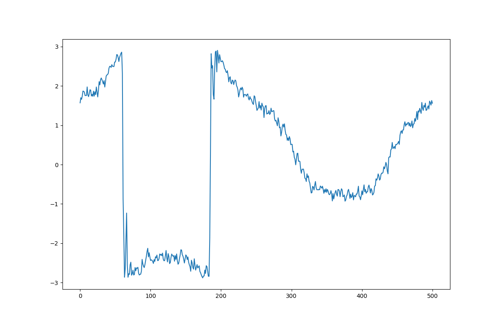

# Particle Filter for Localization

## Instruction:

1. Setup up the system motion model and measurement model
2. Setup inital condition and uncertainty
3. Generate N particles
4. For each particles, perform state transistion and measurment likehoods computation
5. Base on the measuremnt likehoods of each particle, compute the scaled weights for each particles
6. Resampling (pick the most likely partcles)
7. Go back to step 4

## Results:

The position Tracking

The headaing Tracking

